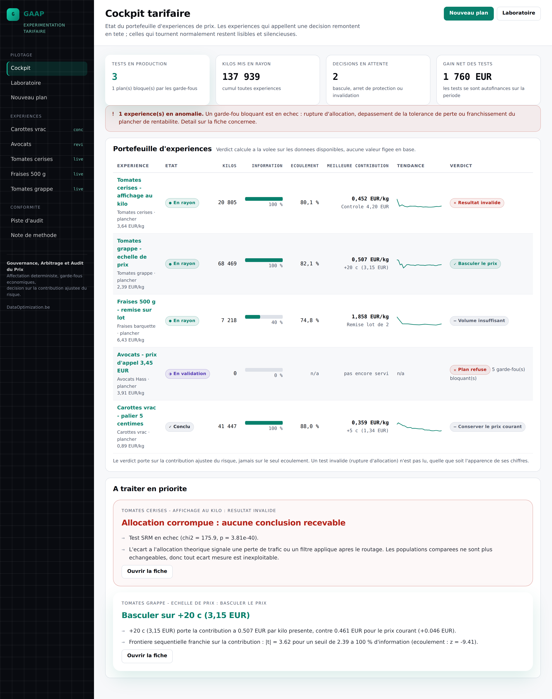
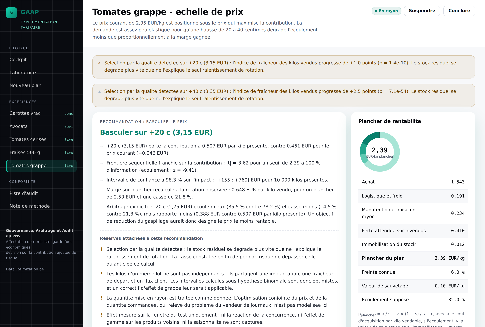
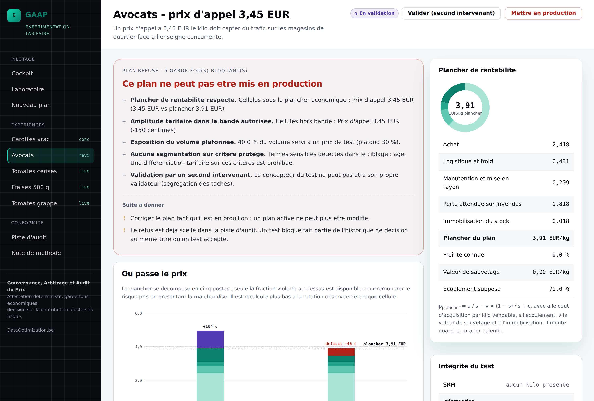
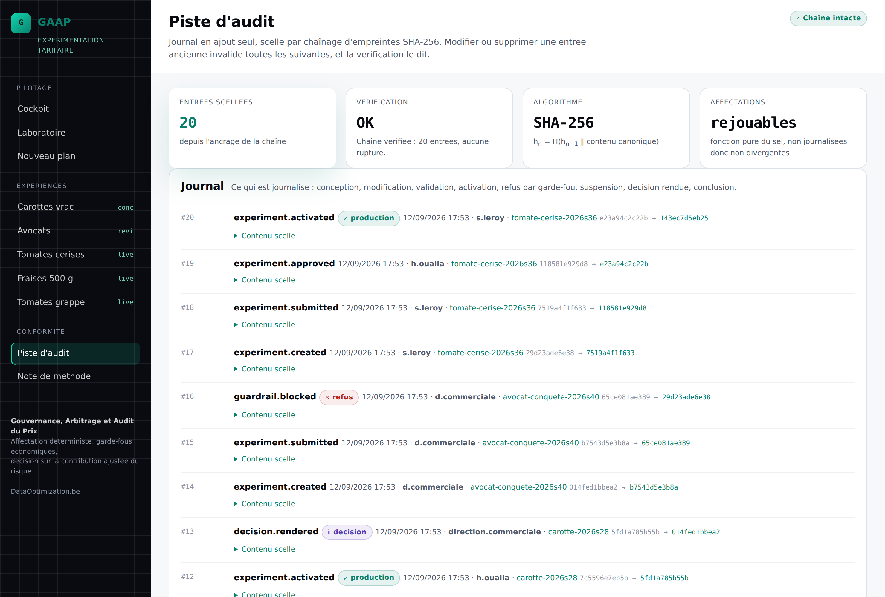
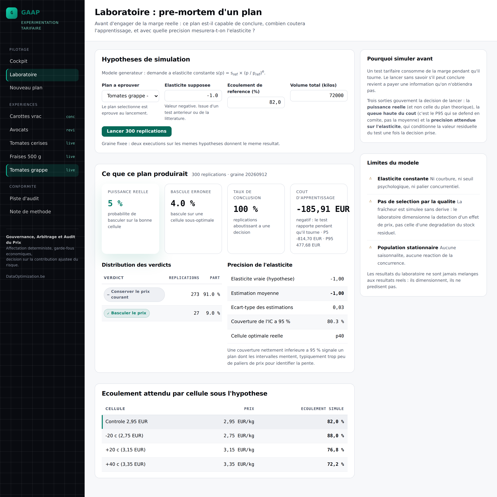
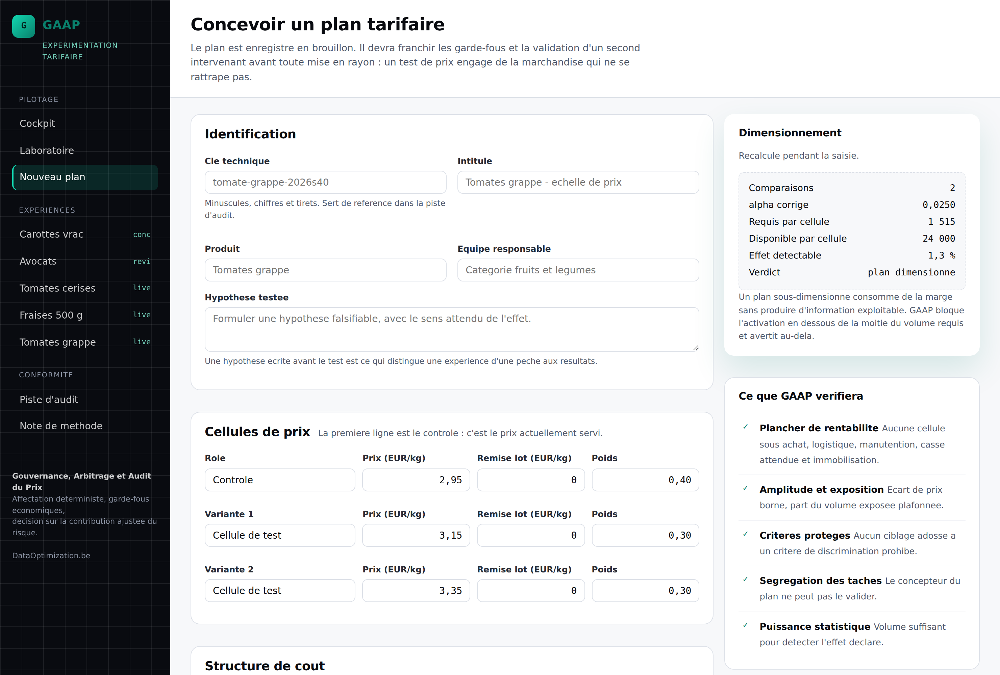

<div align="center">

# GAAP

**G**ouvernance · **A**rbitrage · **A**udit · **P**rix

*Price was never set at random in your history. That is the whole problem.*

[](tests/)
[](pyproject.toml)
[](gaap/domain/)
[](LICENSE)

<sub>**English** · [Français](README.fr.md)</sub>

</div>

---

## What it does

**GAAP tests prices in production, on fresh produce.** Several prices served in parallel to
comparable volumes, randomly assigned, with the decision rule written down before the first shelf
label is printed. The verdict is expressed in euros of margin per kilo put on the shelf.

## Why test rather than model

Historical data rarely answers the question on its own.

Price was not set at random in your shelf history. It moved with the wholesale auction, the
competition, the promotional calendar and the state of the stock, which are the same forces that
moved demand. A regression of sell-through on past prices therefore mixes the effect of price with
the effect of whatever made price change. This is the identification problem of demand estimation,
stated by Working (1927) and unchanged since. Adding controls does not settle it, because the
confounders that matter are the ones nobody recorded.

Observational identification is nonetheless possible, and worth attempting when the conditions hold:
an instrument built on an upstream cost shock, a regression discontinuity at a grading threshold, a
difference-in-differences around a staggered store rollout, or a natural experiment such as a supply
disruption. Each rests on a condition the data cannot verify. An exclusion restriction is an
assumption, not a result, and a weak instrument drags the estimate back toward the OLS it was meant
to repair (Bound, Jaeger & Baker, 1995). A discontinuity identifies the effect at the cutoff only.
And all of them estimate the elasticity of a past assortment under past conditions.

Randomisation manufactures the exogenous variation instead of hoping to find it: on the current
range, at the price steps you choose, with an effect that is causal by construction.

## Why speed is the point

Every week at the wrong price is margin nobody recovers, and in fresh produce it is also stock that
goes in the bin. So the loop has to close as early as the evidence allows: a sequential stopping
boundary fixed before launch, a Bayesian read-out in euros per kilo, and a lab that tells you, before
a single crate is committed, whether the plan can conclude at all and what the learning will cost at
the 95th percentile.

Going fast is only defensible if the downside is bounded. That is what the guardrails are for: no
cell below the profitability floor, a cap on exposed volume, a loss tolerance per kilo fixed before
any result is seen, and an audit trail that makes the price shown on a given lot replayable from the
salt alone.

**Test, conclude, reprice, and be able to explain the decision afterwards.**



<div align="center"><sub>The cockpit: the experiment portfolio, sorted by what needs a decision.</sub></div>

> The interface ships in French. It was built for a Belgian food-retail context, and the screenshots
> are the real application, not mock-ups.

---

### The result that makes the case

Grape tomatoes, four price points, 68 000 kilos on the shelf:

| Price | Sell-through | Waste | Floor at observed rotation | **Margin per kilo shelved** |
|---|---|---|---|---|
| 2.75 € | **85.5%** | **14.5%** | 2.296 € | 0.388 € |
| 2.95 € (control) | 82.1% | 17.9% | 2.388 € | 0.461 € |
| **3.15 €** | 78.2% | 21.8% | 2.502 € | **0.507 €** |
| 3.35 € | 72.0% | 28.0% | 2.708 € | 0.462 € |

The cheapest cell sells through best **and** wastes least **and** earns least. A sell-through target
would pick it. A food-waste target would pick it too. Both would be wrong by 12% of margin.

And the best cell is not the most expensive one either: at 3.35 € the rotation collapses, the floor
climbs to 2.708 €, and the extra margin is eaten by the bin. The contribution curve has an interior
maximum, and the engine finds it.

### About the name

Each letter carries a pillar: **gouvernance** refuses by default anything inadmissible, **arbitrage**
settles the volume-versus-margin trade-off, **audit** makes every decision and every assignment
replayable, all applied to **prix**. The acronym is also a nod to *Generally Accepted Accounting
Principles*, and states the same intention: rules fixed **before** the facts, an audit trail, and a
reasoned opinion rather than a bare number.

---

## Why a price test is not a button test

| | Visual test | Price test on perishables |
|---|---|---|
| **Reversibility** | Rolling back undoes everything. | The crate that did not sell is in the bin. |
| **Cost while running** | Marginal. | Every under-rotating cell burns stock in real time. |
| **Metric** | Conversion rate is enough. | The best-selling price is the lowest admissible one. It frequently destroys margin. |
| **Cost structure** | Fixed. | **The floor depends on the price**, because rotation does, and waste follows rotation. |
| **Population** | Stable. | Price **selects**: a higher price makes shoppers pickier, and the residual stock degrades. |

---

## The five situations in the demonstration portfolio

1. **A switch proven against both sell-through and waste.** The table above.
2. **A test still too young to read.** Strawberries with a multi-buy discount, at 40% of planned
   information. The effect looks enormous, and the sequential rule still forbids concluding.
3. **A test with no economic effect.** Carrots, five cents up: contribution interval
   [−0.003 ; +0.013] € per kilo, compatible with no effect at all.
4. **A plan refused before launch** by five blocking guardrails, including a cell below the floor and
   a targeting rule built on a protected characteristic.
5. **An invalidated test.** Cherry tomatoes, SRM at p = 4 × 10⁻⁴⁰ after a restocking failure on part
   of one cell's stores. The numbers look readable. They are not.

---

## The five pillars

### 1. Assignment is computed, never stored

```
u = uint64( SHA-256( salt ‖ namespace ‖ unit_id )[0:8] ) / 2⁶⁴
```

A pure function of the experiment salt and the unit identifier. The same lot always falls in the same
cell, so a store never shows two prices for one product at the same moment. Every past assignment is
replayable from the salt, so no assignment table exists to diverge from the journal. And because the
salt is per-experiment, a unit is re-randomised from one test to the next.

```bash
flask replay tomate-grappe-2026s37 LOT-0042117
# Experience   : tomate-grappe-2026s37 (Tomates grappe - echelle de prix)
# Sel          : tomate-grappe-2026s37-0f4c9a
# Unite        : LOT-0042117
# Tirage       : 0.467401937101
# Cellule      : m20 - Affecte
# Prix affiche : 2.75 EUR/kg
```

### 2. A profitability floor that moves with the price

```
p_floor = a / s − v × (1 − s) / s + c
```

Acquisition cost per sellable kilo, expected waste, salvage value, working capital. The fourth term
is the structural twin of an expected credit loss: a probability of failure, `(1 − s)`, times the
loss given failure, `a − v`.

**And the floor depends on the price**, because rotation depends on the price and waste follows
rotation. On the demonstration data it moves from 2.08 €/kg at 95% sell-through to 2.99 €/kg at
65%. GAAP therefore recomputes it at each cell's **observed** rotation. Comparing an expensive cell,
which turns slowly and wastes more, against a floor built on the control's rotation would flatter it
mechanically.



### 3. The decision is made on contribution

```
C = sell-through × (effective price − floor)
```

Euros per kilo **shelved**, not per kilo sold: the shelved kilo is the one at risk, so it is the one
that must carry the return. Equivalently `C = s × V + K`, where `V` is what selling a kilo earns over
binning it and `K` is the dead loss of an unsold kilo. The variance is then exactly `s(1−s)V²`, so
intervals are computed without ever reading back an individual observation.

### 4. Guardrails refuse by default

Eight pre-launch checks, five in production, each carrying a stable code that reappears in the audit
trail.



| Code | Check | Severity |
|---|---|---|
| `ECO_FLOOR` | No cell below the profitability floor | Blocking |
| `ECO_BAND` | Price amplitude within the authorised band | Blocking |
| `RISK_EXPOSURE` | Share of volume exposed is capped | Blocking |
| `COMP_PROTECTED` | No targeting built on a prohibited discrimination criterion | Blocking |
| `GOV_FOUR_EYES` | The plan's author does not approve their own plan | Blocking |
| `STAT_POWER` | Volume sufficient to detect the declared effect | Blocking below 50% of required |
| `STAT_HOLDOUT` | Preserved control holdout | Warning |
| `PLAN_DURATION` | Duration bounded | Warning |

In production: the SRM check, a loss tolerance per kilo fixed **before** any result is seen, quality
selection detection, and `ECO_FLOOR_LIVE`, which catches a cell that has slipped under its floor
without any price moving, purely because it stopped turning.

A live plan is **frozen**: cells, weights and salt cannot be modified.

### 5. Everything is sealed



```
h_n = SHA-256( h_{n−1} ‖ timestamp ‖ actor ‖ event ‖ subject ‖ canonical payload )
```

Append-only journal. Modifying or deleting an old entry invalidates every subsequent one, and
verification names both the first broken rank and the nature of the break: chaining, meaning an entry
disappeared, or digest, meaning content was rewritten.

Individual assignments are not logged. They are replayable, and logging them would create a second
source of truth.

---

## The lab: pay for the information, or don't



The lab replays the plan a few hundred times under an assumed elasticity and answers three questions:
whether the plan can conclude at all, what the learning costs at the 95th percentile rather than on
average, and how precisely the elasticity will be measured. Interval coverage at 80% instead of 95%
signals intervals that lie, a worse defect than a lack of power.

The capture above is the case worth showing. Under an assumed elasticity of -1.0, this plan
reaches a decision in every replication and picks the contribution-maximising cell in 5% of
them. The gap between cells is too small to be read at 72 000 kilos, so the engine keeps the
current price 91% of the time. That is the right answer given the data, and a good reason not
to launch this plan as designed.

Fixed seed: two runs on the same assumptions produce the same result.

---

## Designing a plan



Sizing is recomputed as you type.

> Detecting **5% relative** on an 82% sell-through with four cells requires about **1 700 kilos per
> cell**. Far easier than credit, where a 6% take-up demanded tens of thousands of leads per arm.
> High success rates are cheap to measure.

---

## Getting started

```bash
pip install -r requirements.txt

export FLASK_APP=gaap
export GAAP_DATABASE=instance/gaap.sqlite

flask init-db
flask seed --reset        # demonstration portfolio, 100% synthetic data
python run.py             # http://127.0.0.1:5000
```

```bash
gunicorn "gaap:create_app('production')" --bind 0.0.0.0:8000 --workers 4
```

Without `GAAP_SECRET_KEY`, the application starts with an ephemeral key and says so in its logs.

### Command line

```bash
flask report tomate-grappe-2026s37              # full read-out in the console
flask replay tomate-grappe-2026s37 LOT-0042117  # which price this lot carried, and why
flask verify-ledger                             # recompute the hash chain
```

---

## API

| Route | Purpose |
|---|---|
| `POST /api/v1/assign` | Assigns a unit and returns the price to display. |
| `POST /api/v1/observations` | Records the outcome of a shelved kilo: sold or wasted. |
| `GET /api/v1/experiments/<key>/report` | Full report: cells, tests, elasticity, guardrails, recommendation. |
| `POST /api/v1/design/power` | Sizing: required sample size and detectable effect. |
| `GET /api/v1/ledger/verify` | Hash-chain verification. |

```bash
curl -s -X POST localhost:5000/api/v1/assign \
     -H 'Content-Type: application/json' \
     -d '{"experiment":"tomate-grappe-2026s37","unit_id":"LOT-0042117"}'
```
```json
{"cell": "m20", "price": 2.75, "pack_discount": 0.0, "effective_price": 2.75,
 "outcome": "assigned", "bucket": 0.467401937101, "in_analysis": true, "reason": ""}
```

`/assign` **always returns a price.** Inactive experiment, unit out of scope, excluded segment: the
reference price is returned, with the reason.

---

## Architecture

```
gaap/
├── domain/              pure Python, no dependency on Flask or on the database
│   ├── stats.py         distributions, intervals, tests, sizing, sequential, Bayesian
│   ├── pricing.py       waste-adjusted floor, contribution, Lerner rule
│   ├── allocation.py    deterministic hash-based assignment
│   ├── analysis.py      SRM → sell-through → contribution → elasticity
│   ├── guardrails.py    what the engine refuses, before and during
│   ├── decision.py      decision policy, deliberately separate from measurement
│   └── models.py        immutable entities
├── infrastructure/      SQLite, repositories, hash-chained audit trail
├── services/            governed lifecycle, analysis, lab, assignment
├── api/                 REST blueprint
└── web/                 views, templates, server-rendered SVG charts
```

**The engine uses the standard library only.** No numpy, no scipy. The χ², Student and inverse-normal
distributions are implemented and checked against published reference values, so an internal control
function can read the formula that was actually applied without traversing a compiled numerical
stack.

**Charts are SVG rendered server-side.** No CDN, no inline script, which makes a strict Content
Security Policy tenable with no exception, enforced by a test that fails if a template reintroduces
an inline style.

**Measurement and decision are separated.** `analysis.analyse()` measures, `decision.recommend()`
rules, so a different stopping policy can be replayed on unchanged measurements.

---

## Statistical method

| Question | Method | Why this one |
|---|---|---|
| Interval on a sell-through rate | Wilson score (1927) | Keeps coverage at extreme rates, the regime of fresh produce |
| Gap between two rates | Newcombe (1998), method 10 | Correct coverage when one arm is deliberately under-exposed |
| Gap in contribution | Welch's *t* test | Variance scales with `V²`, so homoscedasticity is false by construction |
| Multiple comparisons | Bonferroni | Without it, family-wise error reaches 14% for three variants |
| Allocation integrity | χ² goodness-of-fit, p < 0.001 | A failure invalidates everything |
| Early stopping | O'Brien-Fleming (Lan-DeMets) | A rule written before the test, protecting against *peeking* |
| Bayesian read-out | Beta posteriors on **contribution** | Answers "what is my probability of being wrong if I switch?" |
| Elasticity | Weighted log-log regression | Weights = inverse variance of `ln s` by the delta method |

**The sequential boundary applies to contribution, not sell-through.** Protecting against peeking on
the statistic you do not decide on makes no sense.

**The theoretical optimal price is bounded to the envelope of tested prices.** The Lerner rule also
treats cost as a constant, which it is not here, so GAAP reports it as a direction and never as a
value to apply.

The full methodology note lives **inside the application** (`/methode`) and in
[`docs/METHODOLOGIE.md`](docs/METHODOLOGIE.md) (French).

---

## What GAAP does not measure

- **Category effects.** A cut on grape tomatoes shifts demand away from cherry tomatoes. The test
  measures one product, not one aisle.
- The effect of price on footfall and basket size beyond the tested product.
- Seasonality and novelty effects beyond the test window.
- **The price / order-quantity coupling.** Shelved quantity is treated as given. Optimising it jointly
  with price is the newsvendor problem with endogenous pricing (Petruzzi & Dada, 1999) and is not
  modelled here. This is the model's most serious limitation.
- The behaviour of stores excluded by a guardrail, unobserved by construction.
- Realised shrink: only expected waste enters the calculation.

One limitation deserves its own line, because it is a consequence of a design choice: **the kilos of
one lot are not independent.** They share a shelf, a starting freshness and a footfall. Intervals
computed under a binomial assumption are therefore optimistic, and a cluster-effect correction would
apply in production. Every recommendation the engine issues carries this caveat.

---

## Tests

```bash
pip install -r requirements-dev.txt
pytest                    # 172 tests, ~9 s
```

The suite checks **properties**, not behaviours: assignment stability, hash uniformity, independence
of random streams, floor coherence, detection of audit-trail tampering, refusal of illegal lifecycle
transitions. Statistical reference values come from published tables, not from an earlier run of this
code.

Two properties are pinned as fixed values so that any drift becomes visible: the assignment
fingerprint of eight units, and the floor at the reference cost stack.

---

## Demonstration data

**Every figure is synthetic.** No supplier, no store, no real volume. The orders of magnitude are
chosen to be plausible for a European food retailer; they constitute neither a market reference nor a
pricing recommendation.

The generator is explicit and parameterised: constant-elasticity demand, plus a quality-selection term
making a kilo's chance of selling depend on its freshness as price departs from the reference
(`gaap/demo.py`).

---

## References

- Working (1927), *QJE* 41(2): the identification problem in demand estimation
- Berry, Levinsohn & Pakes (1995), *Econometrica* 63(4); Bound, Jaeger & Baker (1995), *JASA* 90(430)
- Angrist & Pischke (2009), *Mostly Harmless Econometrics*
- Kohavi, Tang & Xu (2020), *Trustworthy Online Controlled Experiments*
- Wilson (1927), *JASA* 22(158); Newcombe (1998), *Statistics in Medicine* 17(8)
- O'Brien & Fleming (1979), *Biometrics* 35(3); Lan & DeMets (1983), *Biometrika* 70(3)
- Fleiss, Levin & Paik (2003), *Statistical Methods for Rates and Proportions*
- Lerner (1934), *Review of Economic Studies* 1(3)
- Petruzzi & Dada (1999), *Operations Research* 47(2): pricing and the newsvendor problem

---

<div align="center">

**[DataOptimization.be](https://www.dataoptimization.be)**

<sub>Data science consulting for pricing, price sensitivity,<br>
customer behaviour and analytical architecture.</sub>

</div>
